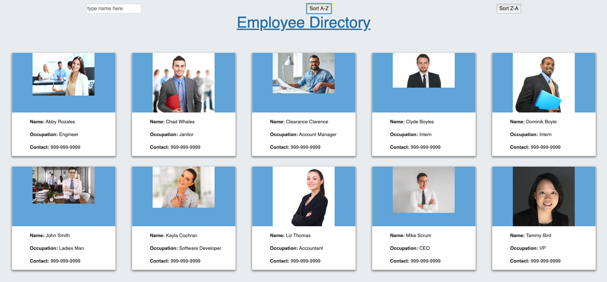
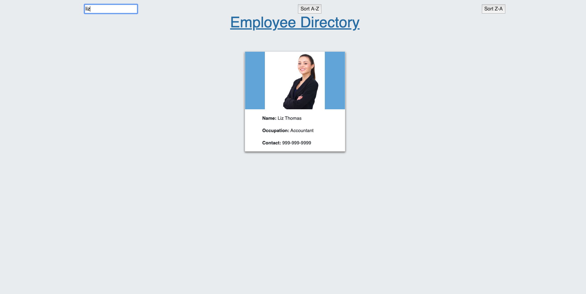
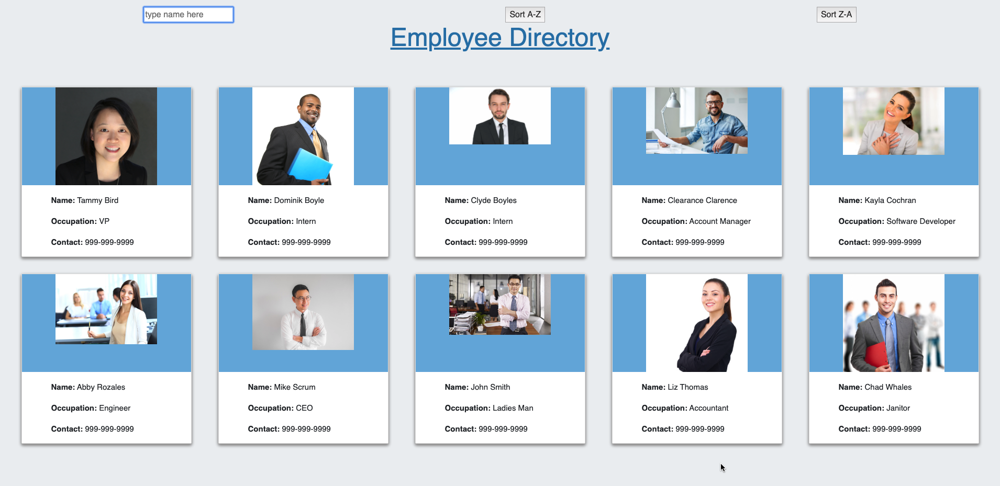

# Employee Directory

## Overview
Create a employee directory with React. This required me to break up the application's UI into components, manage component state, and respond to user events.

## User Story

As a user, I want to be able to view my entire employee directory at once so that I have quick access to their information.

## Business Context
An employee or manager would benefit greatly from being able to view non-sensitive data about other employees. It would be particularly helpful to be able to filter employees by name.

View my deployed site here:

 <a href="https://guarded-tundra-25874.herokuapp.com/">Emloyee Directory</a>

## Techonolgies used:

## Available Scripts & to run the application from your computer once you have cloned the repo:

In the project directory, you can run:

## 'npm install'

This will install all dependencies in order to run the React Application.

### `npm start`

Runs the app in the development mode. 
Open [http://localhost:3000](http://localhost:3000) to view it in the browser.

The page will reload if you make edits. 
You will also see any lint errors in the console.

